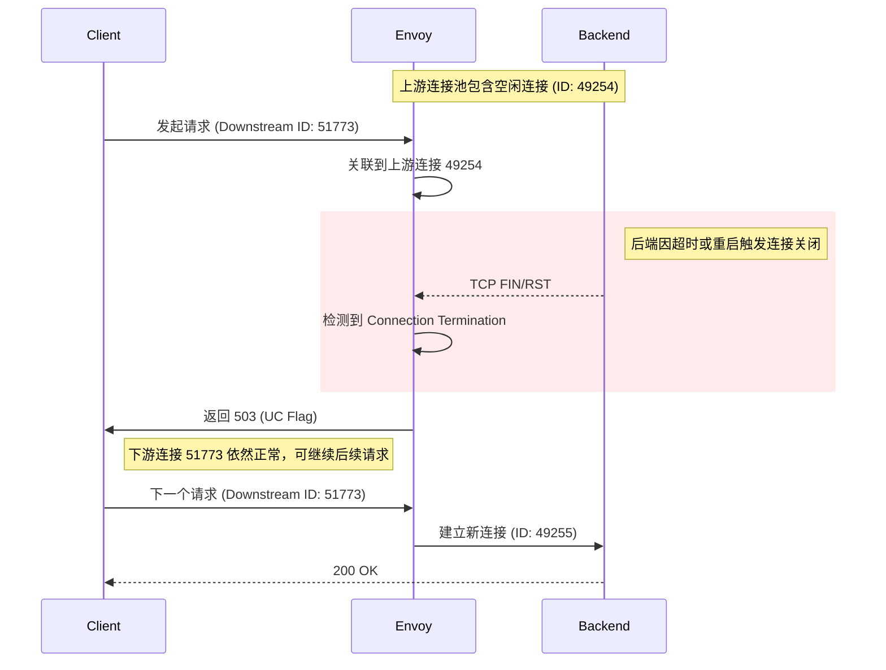

# Envoy 503 UC 问题排查

在微服务架构中，Envoy 作为高性能网关或 Sidecar，其稳定性直接影响业务可用性。开发者常会遇到响应状态码为 `503` 且响应标志位为 `UC`（Upstream Connection Termination）的情况。本文将通过一份真实的 Envoy Debug 日志，深入剖析 `503 UC` 的产生机理、排查方法及解决方案。

## 一、 什么是 503 UC？

在 Envoy 的 Access Log 中，`UC` 代表 **Upstream Connection Termination**。
这意味着：**Envoy 在处理请求的过程中，与后端服务（Upstream）之间的 TCP 连接被异常终止了。** 这种情况通常发生在 Envoy 已经选定了上游主机并尝试发送请求或等待响应的阶段。

---

## 二、 现场还原：日志分析

在定位此类偶发性连接问题时，`info` 日志由于信息缺失，无法定位到具体的问题原因。

可以使用 Envoy 的 Admin API 动态调整日志级别（无需重启）：

```bash
# 修改全局日志级别为 debug (慎用，日志量极大)
curl -X POST http://127.0.0.1:15000/logging?level=debug

# 仅针对关键模块开启 debug 级别 (推荐方案)
curl -X POST http://127.0.0.1:15000/logging?paths=router,http,pool,connection:debug
```

### 1. 完整 Debug 日志示例

以下是一段典型的 Envoy Debug 级别的追踪日志：

```text
[2026-02-26 09:12:33.522][79][debug][router] [source/common/router/upstream_request.cc:591] [Tags: "ConnectionId":"51773","StreamId":"6652572539979160187"] pool ready
[2026-02-26 09:12:33.522][79][debug][pool] [source/common/conn_pool/conn_pool_base.cc:302] [Tags: "ConnectionId":"49254"] using existing fully connected connection
[2026-02-26 09:12:33.522][79][debug][client] [source/common/http/codec_client.cc:142] [Tags: "ConnectionId":"49254"] encode complete
[2026-02-26 09:12:33.522][79][debug][connection] [source/common/network/connection_impl.cc:314] [Tags: "ConnectionId":"49254"] closing socket: 0
[2026-02-26 09:12:33.522][79][debug][client] [source/common/http/codec_client.cc:107] [Tags: "ConnectionId":"49254"] disconnect. resetting 1 pending requests
[2026-02-26 09:12:33.522][79][debug][client] [source/common/http/codec_client.cc:159] [Tags: "ConnectionId":"49254"] Request reset. Reason 7
[2026-02-26 09:12:33.522][79][debug][router] [source/common/router/router.cc:1479] [Tags: "ConnectionId":"51773","StreamId":"6652572539979160187"] upstream reset: reset reason: connection termination
[2026-02-26 09:12:33.522][79][debug][http] [source/common/http/filter_manager.cc:1094] [Tags: "ConnectionId":"51773","StreamId":"6652572539979160187"] Sending local reply with details upstream_reset_before_response_started{connection_termination}
[2026-02-26 09:12:33.522][79][debug][http] [source/common/http/conn_manager_impl.cc:1927] [Tags: "ConnectionId":"51773","StreamId":"6652572539979160187"] encoding headers via codec (end_stream=false): 
':status', '503'
```

### 2. 日志深度解读
*   **ConnectionId: 51773**：这是 **下游连接**（Client -> Envoy）。即便上游出错，这个连接通常仍会保持开启，以便处理后续请求。
*   **ConnectionId: 49254**：这是 **上游连接**（Envoy -> Backend）。
*   **关键动作分析**：
    1.  `pool ready` & `using existing ... connection`: Envoy 从连接池中提取了现有的上游连接 `49254` 准备复用。
    2.  `closing socket: 0`: 在 Envoy 完成请求编码（`encode complete`）的同时，上游连接 `49254` 突然关闭（可能是后端发送了 FIN 或 RST）。
    3.  `upstream reset`: 路由层检测到上游连接断开，触发重置。
    4.  `Sending local reply ... 503`: Envoy 向上游无法送达请求，只能向下游连接 `51773` 返回 503 错误。

### 3. 交互流程图 (Mermaid)
下图展示了这种“陈旧连接复用失败”的典型场景：



---

## 三、 常见诱因与解决方案

### 1. 超时时间不匹配 (Stale Connection)
这是最常见的原因。后端服务的 `KeepAlive` 超时时间设置得比 Envoy 短，导致后端主动关闭连接时，Envoy 仍在尝试复用该连接。
*   **对策**：确保 Envoy 的 `common_http_protocol_options.idle_timeout` **明显短于** 后端服务的空闲超时时间（例如后端 60s，Envoy 设为 45s）。

### 2. 禁用 HTTP 连接复用 (Max Requests = 1)
如果后端服务极度不稳定，或者连接池管理存在复杂干扰，可以尝试禁用连接复用。
*   **对策**：在 Cluster 配置中设置 `max_requests_per_connection: 1`。
*   **原理**：每个 TCP 连接只处理一个 HTTP 请求，处理完即关闭。
*   **优缺点**：彻底消除陈旧连接问题，但会显著增加 TCP/TLS 握手开销，仅建议作为临时排查手段或在极低并发、高可靠性场景下使用。

### 3. 配置合理的重试策略 (Retry Policy)
由于 `UC` 通常发生在请求尚未被上游处理前，这种错误通常是幂等的。
*   **对策**：在路由配置中增加 `retry_on: "reset,connect-failure"`。这样当 Envoy 遇到连接断开时，会自动换一个连接重试，从而屏蔽掉后端的抖动。

### 4. 连接存活检查 (TCP Keep-Alive)
如果中间网络设备（如防火墙、LB）会静默掐断长连接。
*   **对策**：开启上游 Cluster 的 `upstream_connection_options` 中的 TCP Keep-Alive 探测，及时剔除僵尸连接。

---

## 四、 总结

Envoy 的病根往往在 **上游连接的管理与复用策略** 上。通过 Debug 日志理清连接 ID 的演变，配合超时时间微调与重试机制，可以解决绝大多数连接异常问题。在极端不稳定的环境下，牺牲性能开启 `max_requests_per_connection: 1` 也是一种有效的兜底方案。