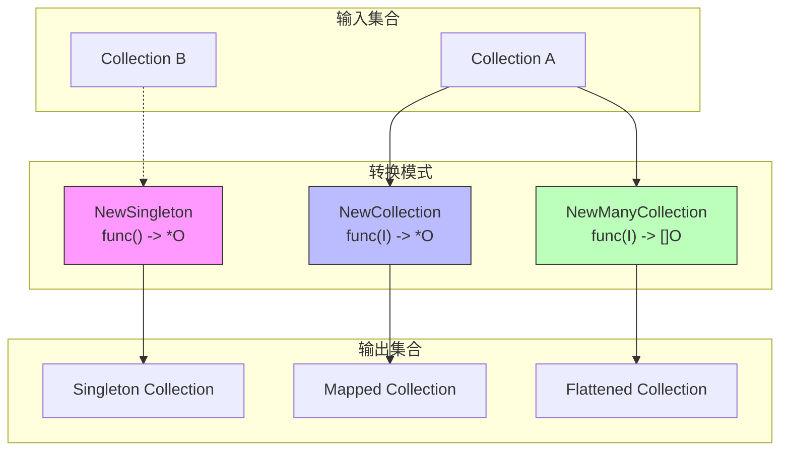
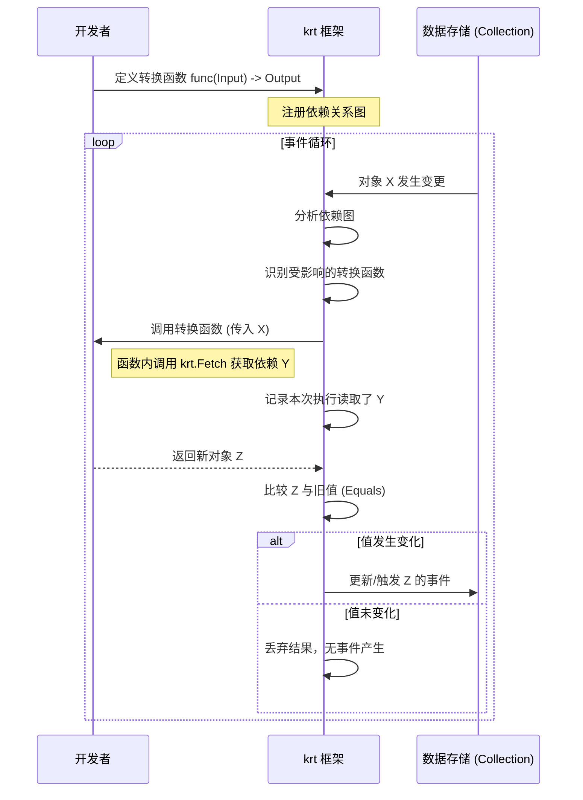

在 Kubernetes 生态系统中，编写 Controller（控制器）是一项常见但充满挑战的任务。传统的 Informer 模式虽然强大，但往往局限于 Kubernetes 原生对象，且状态管理复杂，容易导致代码臃肿和难以维护。

今天我们要介绍的是一个名为 **`krt` (Kubernetes Declarative Controller Runtime)** 的实验性框架。它旨在通过**声明式**的方法重构控制器的编写逻辑，让开发者只需关注“输入到输出”的转换，而将复杂的状态同步、依赖追踪和事件触发交给框架处理。

## 为什么需要 krt？

传统控制器开发面临两大痛点：
1.  **数据源受限**：Kubernetes Informer 只能处理 K8s 对象。如果你的控制器需要融合外部配置、数据库状态或其他非 K8s 资源，通常需要自行编写大量的胶水代码。
2.  **状态管理繁琐**：开发者需要手动管理缓存、判断对象是否变更、处理依赖更新等底层逻辑。

`krt` 的核心愿景是：
*   **通用性**：可以操作任何类型的对象，无论来源是 K8s Informer、静态配置还是其他数据源。
*   **高层抽象**：开发者只需编写简单的转换函数 `Input -> Output`，框架自动处理所有状态和依赖关系。

---

## 核心原语：Collection

`krt` 中最基本的构建块是 **`Collection`** 接口。你可以把它理解为一个不绑定于 Kubernetes 的通用 `Informer`。

### Collection 的三种构建方式
1.  **包装现有 Informer**：通过 `WrapClient` 或 `NewInformer` 将 K8s Informer 转换为 Collection。
2.  **静态配置**：使用 `NewStatic` 创建静态数据集合。
3.  **派生集合 (Derived Collections)**：这是 `krt` 的灵魂，基于其他 Collection 通过转换函数生成新的 Collection。

### 对象要求
虽然 `Collection` 可以容纳任意 Go 类型，但这些对象通常需要实现以下约定（受限于 Go 泛型系统，这些未强制约束，但需遵守）：
*   **唯一键 (Key)**：每个对象必须有唯一的 Key。
*   **相等性判断 (Equals)**：用于检测对象是否发生变更（默认支持 K8s 和 Protobuf 对象， fallback 到 `reflect.DeepEqual`）。
*   **元数据**：可选的 Name, Namespace, Labels 等，用于过滤。

---

## 核心机制：派生集合与转换函数

`krt` 的强大之处在于能够从一个或多个现有的 Collection **派生**出新的 Collection。这通过定义转换函数来实现。框架会自动追踪依赖：当输入数据变化时，仅重新计算受影响的输出部分。

目前支持三种主要的转换模式：



### 1. 单例模式 (`NewSingleton`)
*   **签名**: `func() *O`
*   **场景**: 生成单个值，通常用于全局统计或聚合配置。
*   **示例**: 统计集群中 ConfigMap 的总数。

```go
ConfigMapCount := krt.NewSingleton[int](func(ctx krt.HandlerContext) *int {
    // Fetch 自动建立依赖关系
    cms := krt.Fetch(ctx, ConfigMaps) 
    return ptr.Of(len(cms))
})
// 只有当 ConfigMap 数量变化时，此集合才会触发事件
```

### 2. 一对一映射 (`NewCollection`)
*   **签名**: `func(input I) *O`
*   **场景**: 将一种对象类型转换为另一种，保持数量不变。
*   **优势**: 相比手动遍历列表，这种方式效率极高。如果只有一个 Pod 变化，框架只会重新计算对应的那个输出对象，而不是整个列表。

```go
// 错误做法：低效，每次变动全量重算
SimplePodsBad := krt.NewSingleton[[]SimplePod](func(ctx krt.HandlerContext) *[]SimplePod {
    res := []SimplePod{}
    for _, pod := range krt.Fetch(ctx, Pods) {
        res = append(res, SimplePod{Name: pod.Name})
    }
    return &res
})

// 正确做法：高效，细粒度更新
SimplePods := krt.NewCollection[SimplePod](func(ctx krt.HandlerContext, pod *v1.Pod) *SimplePod {
    return &SimplePod{Name: pod.Name}
})
```

### 3. 一对多映射 (`NewManyCollection`)
*   **签名**: `func(input I) []O`
*   **场景**: 一个输入对象产生多个输出对象（扁平化）。
*   **示例**: 从 Service 生成多个 Endpoint，或从 Pod 提取所有容器名称。

```go
// 提取所有容器名称
ContainerNames := krt.NewManyCollection[string](func(ctx krt.HandlerContext, pod *v1.Pod) []string {
    var res []string
    for _, c := range pod.Spec.Containers {
        res = append(res, c.Name)
    }
    return res
})
```

---

## 智能依赖追踪与 Fetch 机制

在转换函数中，你不能随意访问全局变量或外部 API。所有的数据获取必须通过 `krt.Fetch`。

### 运行机制图解



### Fetch 的高级过滤
`krt.Fetch` 不仅仅是获取数据，它还支持高效的过滤。框架会在底层优化过滤逻辑，避免加载不匹配的对象。

支持的过滤器包括：
*   `FilterName`, `FilterNamespace`: 基础字段过滤。
*   `FilterLabel`: 标签匹配。
*   `FilterSelects`: 选择器匹配（空选择器匹配所有）。
*   `FilterGeneric`: 自定义函数过滤。

**注意**：如果对象没有实现相应的字段提取方法，使用特定过滤器可能会导致 panic。

---

## 最佳实践与约束

为了保障框架能正确追踪依赖和去重，转换函数必须遵循以下**铁律**：

1.  **无状态 (Stateless)**：函数内部不能持有可变状态。
2.  **幂等 (Idempotent)**：相同的输入必须始终产生相同的输出。
3.  **禁止侧效应**：
    *   所有依赖数据必须通过 `krt.Fetch` 获取。
    *   禁止查询外部数据库、文件系统或发起 HTTP 请求。
    *   禁止修改传入的对象。

违反这些规则会导致未定义行为（通常是数据 stale 或不更新）。

### 选型指南：该用哪种 Collection？

| 场景 | 推荐类型 | 原因 |
| :--- | :--- | :--- |
| 全局统计/聚合配置 | `NewSingleton` | 自然表达单一值语义 |
| 对象类型转换 (1对1) | `NewCollection` | **性能最优**，细粒度更新，支持标签查询 |
| 对象展开/扁平化 (1对多) | `NewManyCollection` | 自动处理列表展开，避免 `Collection([]T)` 的反模式 |
| 原子列表 (不可拆分) | `NewSingleton` (包裹 struct) | 如果列表必须作为一个整体被消费，将其封装在 struct 中 |

> **反模式警告**：尽量避免创建 `Collection[]Type`（即集合元素本身是一个切片）。这通常意味着你应该使用 `NewManyCollection` 来扁平化数据，或者将切片封装在一个结构体中作为原子单元。

---

## 性能表现与未来展望

### 性能基准
根据官方 Benchmark，`krt` 相比理想的手写控制器约有 **10%** 的性能开销，但在内存分配上略高。

```text
name                  time/op
Controllers/krt       13.4ms ±23%
Controllers/legacy    11.4ms ± 6%

name                  alloc/op
Controllers/krt       15.2MB ± 0%
Controllers/legacy    12.9MB ± 0%
```

考虑到手写完美优化的控制器极其困难且容易出错，`krt` 提供的自动化优化（如自动跳过未变化的依赖、细粒度重计算）使得它在大多数实际场景中表现优异，甚至优于粗糙的手写实现。这就像高级语言与汇编的关系：编译器（框架）能做人类容易忽略的优化。

### 未来方向
`krt` 目前处于实验阶段（已在 Istio Ambient Controller 中尝试应用），未来的优化方向包括：
1.  **对象级优化**：自动检测转换函数中实际使用的字段子集，减少不必要的比较和更新。
2.  **依赖结构优化**：共享常见依赖（如 Namespace 过滤），减少内存占用。
3.  **可观测性增强**：
    *   集成 OpenTelemetry 追踪。
    *   **自动生成 Mermaid 图表**：可视化展示控制器之间的依赖关系，极大简化调试过程。
    *   自动检测违反转换约束的行为。

## 总结

`krt` 代表了 Kubernetes 控制器开发的一种新范式：**声明式优于命令式**。通过将复杂的依赖管理和状态同步下沉到框架层，开发者可以更专注于业务逻辑本身。虽然目前仍有少量性能开销，但其带来的开发效率提升、代码可维护性以及潜在的自动化优化能力，使其成为构建下一代云原生控制器的有力候选者。

如果你正在为复杂的依赖关系头疼，或者希望你的控制器能轻松处理非 K8s 数据源，不妨关注一下 `krt` 的发展。