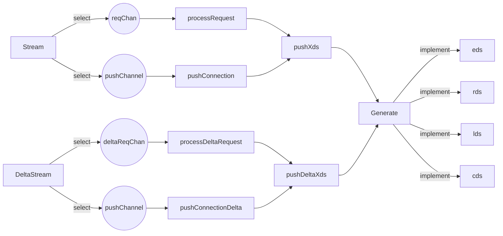
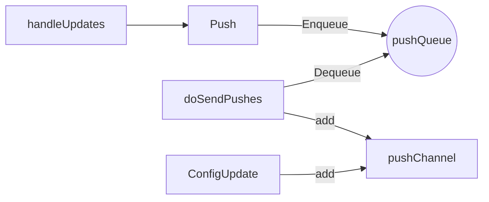
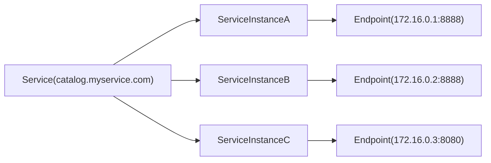

## Istio 代码结构
以下列举了 istio 中一些核心的代码目录。

```
├── cni # istio-cni，用于替代init-container
├── istioctl # istioctl命令行工具
├── manifests # 部署文件，CRD，Helm Chart等
├── operator # 以operator模式控制istio的安装和升级
├── pilot
├── pkg # 各种包
├── security # citadel
└── tools # 各种工具，例如istio-iptables
```

## istio-cni
默认情况下，Istio 会在网格中部署的 Pod 上注入一个 initContainer：istio-init。 istio-init 容器会将 Pod 的网络流量劫持到 Istio Sidecar 代理上。 这需要用户或部署 Pod 的 Service Account 具有足够的部署 NET_ADMIN 容器的 Kubernetes RBAC 权限。Istio 用户权限的提升，对于某些组织的安全政策来说，可能是难以接受的。 Istio CNI 插件就是一个能够替代 istio-init 容器来实现相同的网络功能但却不需要 Istio 用户申请额外的 Kubernetes RBAC 授权的方案。

Istio CNI 插件会在 Kubernetes Pod 生命周期的网络设置阶段完成 Istio 网格 Pod 流量转发设置的工作， 因此用户在部署 Pod 到 Istio 网格中时，不再需要配置 NET_ADMIN 功能需求了。 Istio CNI 插件代替了 istio-init 容器所实现的功能。

## pilot
pilot 关键目录结构如下。
```
├── cmd
│   ├── pilot-agent # 作为istio-proxy的一部分运行在sidecar中
│   └── pilot-discovery # 作为istiod的一部分
└──pkg
    ├── autoregistration
    ├── bootstrap
    ├── config
    ├── credentials
    ├── features
    ├── grpc
    ├── keycertbundle
    ├── leaderelection
    ├── model
    ├── networking
    ├── request
    ├── security
    ├── server
    ├── serviceregistry
    ├── simulation
    ├── status
    ├── trustbundle
    ├── util
    └── xds
```

### pilot-agent
pilot-agent 启动过程的关键函数如下，负责配置启动 Envoy ，拉起 StatusServer对 Envoy 以及服务状态进行探测，同时初始化 STSServer 服务器。
```go
// pilot/cmd/pilot-agent/app/cmd.go
// 初始化状态探测服务器，对服务以及Envoy状态进行探测
func initStatusServer(
	ctx context.Context,
	proxy *model.Proxy,
	proxyConfig *meshconfig.ProxyConfig,
	envoyPrometheusPort int,
	enableProfiling bool,
	agent *istio_agent.Agent,
	shutdown context.CancelFunc,
) error {}

// 初始化sts（security token service）服务器
// STS is used for stackdriver or other Envoy services using google gRPC.
func initStsServer(proxy *model.Proxy, tokenManager security.TokenManager) (*stsserver.Server, error) {}

// 初始化Envoy Proxy
func initProxy(args []string) (*model.Proxy, error) {}
```

#### StatusServer
```go
// pilot/cmd/pilot-agent/status/server.go
// Server provides an endpoint for handling status probes.
type Server struct {
	ready                 []ready.Prober
	prometheus            *PrometheusScrapeConfiguration
	mutex                 sync.RWMutex
	appProbersDestination string
	appKubeProbers        KubeAppProbers
	appProbeClient        map[string]*http.Client
	statusPort            uint16
	lastProbeSuccessful   bool
	envoyStatsPort        int
	fetchDNS              func() *dnsProto.NameTable
	upstreamLocalAddress  *net.TCPAddr
	config                Options
	http                  *http.Client
	enableProfiling       bool
	registry              prometheus.Gatherer
	shutdown              context.CancelFunc
	drain                 func()
}
```

#### STSServer
 Istio 中的 STS (Security Token Service) 服务器运行在 sidecar 代理容器中,主要用于提供安全令牌的签发和验证功能，支持 Istio 的安全通信和身份验证。

具体来说，STS 服务器在 sidecar 中的作用包括:

- **工作负载令牌签发**
   当工作负载容器需要访问其他服务时，sidecar 中的 STS 服务器可以为其签发安全令牌(如 JWT 令牌)。这些令牌包含了工作负载的身份信息,用于后续的身份验证和授权。
- **令牌交换**
   当工作负载需要访问外部服务(如云服务)时，sidecar 中的 STS 服务器可以使用自己的令牌来代表工作负载请求外部服务的访问令牌。这种"令牌交换"机制简化了身份验证流程。
- **令牌验证**
   当收到其他工作负载发送的请求时，sidecar 中的 STS 服务器可以验证请求中携带的令牌，确认请求方的身份合法性。

例如,在一个使用 Istio 的微服务架构中:

- 服务 A 的 sidecar 会在 A 访问服务 B 时，为 A 签发一个令牌。
- 服务 B 的 sidecar 会验证来自 A 的请求中携带的令牌，确认 A 的身份后再决定是否允许访问。
- 如果服务 B 需要访问外部云服务，其 sidecar 可以代表 B 获取外部云服务的访问令牌。

更多关于STS的知识参考[https://johnnyqian.net/blog/security-token-service.html](https://johnnyqian.net/blog/security-token-service.html)。
```go
// security/pkg/stsservice/server/server.go
// Server watches HTTP requests for security token service (STS), and returns
// token in response.
type Server struct {
	// tokenManager takes STS request parameters and generates tokens, and returns
	// generated token to the STS server.
	tokenManager security.TokenManager
	stsServer    *http.Server
	// Port number that server listens on.
	Port int
}
```

### pilot-discovery

#### Server 启动

启动多个携程以接收和处理事件。

```go
// pilot/pkg/xds/discovery.go
func (s *DiscoveryServer) Start(stopCh <-chan struct{}) {
	go s.WorkloadEntryController.Run(stopCh)
	go s.handleUpdates(stopCh)
	go s.periodicRefreshMetrics(stopCh)
	go s.sendPushes(stopCh)
	go s.Cache.Run(stopCh)
}
```

当集群 CR 发生变更之后，对应的 controllers 会监听到变化，并生成 `PushRequest` 存入 `pushChannel` 中，server 监听到 channel 中变化并进行处理，`pushXds` 函数会调用 `Generate` 函数将变更转化为不同的 XDS 配置，`Generate` 是一个接口，不同的 XDS 均实现了该接口。

同时当 Envoy 向 Pilot 发送推送请求时，请求将存入 `reqChan`中进行相同的处理。

以上描述了全量推送的过程，增量推送过程与之类似。





#### xds 分发

[https://blog.csdn.net/qq_40378034/article/details/131879232](https://blog.csdn.net/qq_40378034/article/details/131879232)

### PushContext

`PushContext` 是在 XDS 推送中最重要的一个结构体，记录了推送必要的状态信息。例如 `VirtualService` 的记录，每次推送就是在先前版本的 `PushContext` 的基础上生成一个新版本的 `PushContext`， 并利用新版本生成 XDS 配置并推送。

```go
// PushContext tracks the status of a push - metrics and errors.
// Metrics are reset after a push - at the beginning all
// values are zero, and when push completes the status is reset.
// The struct is exposed in a debug endpoint - fields public to allow
// easy serialization as json.
type PushContext struct {
	proxyStatusMutex sync.RWMutex
	// ProxyStatus is keyed by the error code, and holds a map keyed
	// by the ID.
	ProxyStatus map[string]map[string]ProxyPushStatus

	// Synthesized from env.Mesh
	exportToDefaults exportToDefaults

	// ServiceIndex is the index of services by various fields.
	ServiceIndex serviceIndex

	// serviceAccounts contains a map of hostname and port to service accounts.
	serviceAccounts map[serviceAccountKey][]string

	// virtualServiceIndex is the index of virtual services by various fields.
	virtualServiceIndex virtualServiceIndex

	// destinationRuleIndex is the index of destination rules by various fields.
	destinationRuleIndex destinationRuleIndex

	// gatewayIndex is the index of gateways.
	gatewayIndex gatewayIndex

	// clusterLocalHosts extracted from the MeshConfig
	clusterLocalHosts ClusterLocalHosts

	// sidecarIndex stores sidecar resources
	sidecarIndex sidecarIndex

	// envoy filters for each namespace including global config namespace
	envoyFiltersByNamespace map[string][]*EnvoyFilterWrapper

	// wasm plugins for each namespace including global config namespace
	wasmPluginsByNamespace map[string][]*WasmPluginWrapper

	// AuthnPolicies contains Authn policies by namespace.
	AuthnPolicies *AuthenticationPolicies `json:"-"`

	// AuthzPolicies stores the existing authorization policies in the cluster. Could be nil if there
	// are no authorization policies in the cluster.
	AuthzPolicies *AuthorizationPolicies `json:"-"`

	// Telemetry stores the existing Telemetry resources for the cluster.
	Telemetry *Telemetries `json:"-"`

	// ProxyConfig stores the existing ProxyConfig resources for the cluster.
	ProxyConfigs *ProxyConfigs `json:"-"`

	// The following data is either a global index or used in the inbound path.
	// Namespace specific views do not apply here.

	// Mesh configuration for the mesh.
	Mesh *meshconfig.MeshConfig `json:"-"`

	// PushVersion describes the push version this push context was computed for
	PushVersion string

	// LedgerVersion is the version of the configuration ledger
	LedgerVersion string

	// JwtKeyResolver holds a reference to the JWT key resolver instance.
	JwtKeyResolver *JwksResolver

	// GatewayAPIController holds a reference to the gateway API controller.
	GatewayAPIController GatewayController

	// cache gateways addresses for each network
	// this is mainly used for kubernetes multi-cluster scenario
	networkMgr *NetworkManager

	Networks *meshconfig.MeshNetworks

	InitDone        atomic.Bool
	initializeMutex sync.Mutex
	ambientIndex    AmbientIndexes
}
```

`PushRequest` 则定义了一次推送相关信息，其定义如下

```go
// pilot/pkg/model/push_context.go
// PushRequest defines a request to push to proxies
// It is used to send updates to the config update debouncer and pass to the PushQueue.
type PushRequest struct {
	// Full determines whether a full push is required or not. If false, an incremental update will be sent.
	// Incremental pushes:
	// * Do not recompute the push context
	// * Do not recompute proxy state (such as ServiceInstances)
	// * Are not reported in standard metrics such as push time
	// As a result, configuration updates should never be incremental. Generally, only EDS will set this, but
	// in the future SDS will as well.
	Full bool

	// ConfigsUpdated keeps track of configs that have changed.
	// This is used as an optimization to avoid unnecessary pushes to proxies that are scoped with a Sidecar.
	// If this is empty, then all proxies will get an update.
	// Otherwise only proxies depend on these configs will get an update.
	// The kind of resources are defined in pkg/config/schemas.
	ConfigsUpdated sets.Set[ConfigKey]

	// Push stores the push context to use for the update. This may initially be nil, as we will
	// debounce changes before a PushContext is eventually created.
	Push *PushContext

	// Start represents the time a push was started. This represents the time of adding to the PushQueue.
	// Note that this does not include time spent debouncing.
	Start time.Time

	// Reason represents the reason for requesting a push. This should only be a fixed set of values,
	// to avoid unbounded cardinality in metrics. If this is not set, it may be automatically filled in later.
	// There should only be multiple reasons if the push request is the result of two distinct triggers, rather than
	// classifying a single trigger as having multiple reasons.
	Reason ReasonStats

	// Delta defines the resources that were added or removed as part of this push request.
	// This is set only on requests from the client which change the set of resources they (un)subscribe from.
	Delta ResourceDelta
}

```

### config controllers

```
├── aggregate
├── file
│   └── util
├── kube # k8s controllers
│   ├── crd
│   ├── crdclient ## VirtualService, DestinationRule, etc.
│   ├── gateway
│   └── ingress
├── memory
└── monitor
```

### config

`ConfigController` 用于控制 CR 例如 VirtualService、DestinationRule 等。当 CR 进行更新时，Pilot 会将生成新的 PushRequest 将配置变化推送给 Envoy。

```go
// pilot/pkg/bootstrap/configcontroller.go
func (s *Server) initConfigController(args *PilotArgs) error {
	s.initStatusController(args, features.EnableStatus && features.EnableDistributionTracking)
	meshConfig := s.environment.Mesh()
	if len(meshConfig.ConfigSources) > 0 {
		// Using MCP for config.
		if err := s.initConfigSources(args); err != nil {
			return err
		}
	} else if args.RegistryOptions.FileDir != "" {
		// Local files - should be added even if other options are specified
		store := memory.Make(collections.Pilot)
		configController := memory.NewController(store)

		err := s.makeFileMonitor(args.RegistryOptions.FileDir, args.RegistryOptions.KubeOptions.DomainSuffix, configController)
		if err != nil {
			return err
		}
		s.ConfigStores = append(s.ConfigStores, configController)
	} else {
		err := s.initK8SConfigStore(args)
		if err != nil {
			return err
		}
	}
	...
}
```

注册对于 CR 变化处理的函数。

```go
// pilot/pkg/bootstrap/server.go
// initRegistryEventHandlers sets up event handlers for config and service updates
func (s *Server) initRegistryEventHandlers() {
	log.Info("initializing registry event handlers")
	// Flush cached discovery responses whenever services configuration change.
	serviceHandler := func(prev, curr *model.Service, event model.Event) {
		pushReq := &model.PushRequest{
			Full:           true,
			ConfigsUpdated: sets.New(model.ConfigKey{Kind: kind.ServiceEntry, Name: string(curr.Hostname), Namespace: curr.Attributes.Namespace}),
			Reason:         model.NewReasonStats(model.ServiceUpdate),
		}
		s.XDSServer.ConfigUpdate(pushReq)
	}
	s.ServiceController().AppendServiceHandler(serviceHandler)

	if s.configController != nil {
		configHandler := func(prev config.Config, curr config.Config, event model.Event) {
			if s.statusReporter != nil {
				defer func() {
					if event != model.EventDelete {
						s.statusReporter.AddInProgressResource(curr)
					} else {
						s.statusReporter.DeleteInProgressResource(curr)
					}
				}()
			}
			log.Debugf("Handle event %s for configuration %s", event, curr.Key())
			// For update events, trigger push only if spec has changed.
			if event == model.EventUpdate && !needsPush(prev, curr) {
				log.Debugf("skipping push for %s as spec has not changed", prev.Key())
				return
			}
			pushReq := &model.PushRequest{
				Full:           true,
				ConfigsUpdated: sets.New(model.ConfigKey{Kind: kind.MustFromGVK(curr.GroupVersionKind), Name: curr.Name, Namespace: curr.Namespace}),
				Reason:         model.NewReasonStats(model.ConfigUpdate),
			}
			s.XDSServer.ConfigUpdate(pushReq)
		}
		schemas := collections.Pilot.All()
		if features.EnableGatewayAPI {
			schemas = collections.PilotGatewayAPI().All()
		}
		for _, schema := range schemas {
			// This resource type was handled in external/servicediscovery.go, no need to rehandle here.
			if schema.GroupVersionKind() == gvk.ServiceEntry {
				continue
			}
			if schema.GroupVersionKind() == gvk.WorkloadEntry {
				continue
			}
			if schema.GroupVersionKind() == gvk.WorkloadGroup {
				continue
			}

			s.configController.RegisterEventHandler(schema.GroupVersionKind(), configHandler)
		}
		if s.environment.GatewayAPIController != nil {
			s.environment.GatewayAPIController.RegisterEventHandler(gvk.Namespace, func(config.Config, config.Config, model.Event) {
				s.XDSServer.ConfigUpdate(&model.PushRequest{
					Full:   true,
					Reason: model.NewReasonStats(model.NamespaceUpdate),
				})
			})
			s.environment.GatewayAPIController.RegisterEventHandler(gvk.Secret, func(_ config.Config, gw config.Config, _ model.Event) {
				s.XDSServer.ConfigUpdate(&model.PushRequest{
					Full: true,
					ConfigsUpdated: map[model.ConfigKey]struct{}{
						{
							Kind:      kind.KubernetesGateway,
							Name:      gw.Name,
							Namespace: gw.Namespace,
						}: {},
					},
					Reason: model.NewReasonStats(model.SecretTrigger),
				})
			})
		}
	}
}
```

```go
// pilot/pkg/bootstrap/server.go
// 处理CR如VirtualService等发生变化的事件，生成PushRequest
// 之后利用PushRequest对XDS进行更新
configHandler := func(prev config.Config, curr config.Config, event model.Event) {
	if s.statusReporter != nil {
		defer func() {
			if event != model.EventDelete {
				s.statusReporter.AddInProgressResource(curr)
			} else {
				s.statusReporter.DeleteInProgressResource(curr)
			}
		}()
	}
	log.Debugf("Handle event %s for configuration %s", event, curr.Key())
	// For update events, trigger push only if spec has changed.
	if event == model.EventUpdate && !needsPush(prev, curr) {
		log.Debugf("skipping push for %s as spec has not changed", prev.Key())
		return
	}
	pushReq := &model.PushRequest{
		Full:           true,
		ConfigsUpdated: sets.New(model.ConfigKey{Kind: kind.MustFromGVK(curr.GroupVersionKind), Name: curr.Name, Namespace: curr.Namespace}),
		Reason:         model.NewReasonStats(model.ConfigUpdate),
	}
	s.XDSServer.ConfigUpdate(pushReq)
}
```

### ServiceRegistry

`ServiceRegistry` 定义了 `Controller` 结构体对不同的服务注册中心进行管理。前几行的代码中的两行声明是Go语言中的"空白标识符"语法。它们不会实际声明任何变量或值,而是用于确保某些类型实现了特定接口。如果类型没有正确实现所需的接口，Go编译器将报错。

```go
// pilot/pkg/serviceregistry/aggregate/controller.go
// The aggregate controller does not implement serviceregistry.Instance since it may be comprised of various
// providers and clusters.
var (
	_ model.ServiceDiscovery    = &Controller{}
	_ model.AggregateController = &Controller{}
)

// Controller aggregates data across different registries and monitors for changes
type Controller struct {
	meshHolder mesh.Holder

	// The lock is used to protect the registries and controller's running status.
	storeLock  sync.RWMutex
	registries []*registryEntry
	// indicates whether the controller has run.
	// if true, all the registries added later should be run manually.
	running bool

	handlers          model.ControllerHandlers
	handlersByCluster map[cluster.ID]*model.ControllerHandlers
	model.NetworkGatewaysHandler
}
```

`ControllerHandlers` 定义如下，分为 `ServiceHandlers` 和 `WorkloadHandlers` 两部分，分别对 Istio 服务，Pod 和 WorkloadEntry 进行处理。WorkloadEntry 将非 k8s 例如 VM 中的服务进行了抽象，相当于转换为集群中的 Pod ，从而可以对 VM 和 Pod 在 ServiceEntry 中进行相同的处理，例如通过 label 进行选择。介绍见[https://istio.io/latest/zh/blog/2020/workload-entry/](https://istio.io/latest/zh/blog/2020/workload-entry/)。

```go
// ControllerHandlers is a utility to help Controller implementations manage their lists of handlers.
type ControllerHandlers struct {
	mutex            sync.RWMutex
	serviceHandlers  []ServiceHandler
	workloadHandlers []func(*WorkloadInstance, Event)
}
```

aggregate controller 传入了以下 service handler：

```go
// pilot/pkg/bootstrap/server.go
serviceHandler := func(prev, curr *model.Service, event model.Event) {
	pushReq := &model.PushRequest{
		Full:           true,
		ConfigsUpdated: sets.New(model.ConfigKey{Kind: kind.ServiceEntry, Name: string(curr.Hostname), Namespace: curr.Attributes.Namespace}),
		Reason:         model.NewReasonStats(model.ServiceUpdate),
	}
	s.XDSServer.ConfigUpdate(pushReq)
}
s.ServiceController().AppendServiceHandler(serviceHandler)
```

当添加新的 registry 的时候，会向该 registry 中添加如下的 service handler，也即遍历 controller handler 中所有的 handler 并运行。

```go
// pilot/pkg/serviceregistry/aggregate/controller.go
registry.AppendServiceHandler(c.handlers.NotifyServiceHandlers)
registry.AppendServiceHandler(func(prev, curr *model.Service, event model.Event) {
	for _, handlers := range c.getClusterHandlers() {
		handlers.NotifyServiceHandlers(prev, curr, event)
	}
})

// pilot/pkg/model/controller.go
func (c *ControllerHandlers) NotifyServiceHandlers(prev, curr *Service, event Event) {
	for _, f := range c.GetServiceHandlers() {
		f(prev, curr, event)
	}
}

```

Registry Instance 代表了一个注册中心的实例，例如 Kubernetes，可以用于查询现有的服务。

```go
// pilot/pkg/serviceregistry/aggregate/controller.go
type registryEntry struct {
	serviceregistry.Instance
	// stop if not nil is the per-registry stop chan. If null, the server stop chan should be used to Run the registry.
	stop <-chan struct{}
}

// pilot/pkg/serviceregistry/instance.go
type Instance interface {
	model.Controller
	model.ServiceDiscovery

	// Provider backing this service registry (i.e. Kubernetes etc.)
	Provider() provider.ID

	// Cluster for which the service registry applies. Only needed for multicluster systems.
	Cluster() cluster.ID
}
```

#### Service

`Service` 可以通俗的理解为一个域名下包含的服务总和，一个域名可以包含多个端口，每个端口也可以路由至不同的端点，不同的端点可能运行着不同的服务。

```go
// Service describes an Istio service (e.g., catalog.mystore.com:8080)
// Each service has a fully qualified domain name (FQDN) and one or more
// ports where the service is listening for connections. *Optionally*, a
// service can have a single load balancer/virtual IP address associated
// with it, such that the DNS queries for the FQDN resolves to the virtual
// IP address (a load balancer IP).
//
// E.g., in kubernetes, a service foo is associated with
// foo.default.svc.cluster.local hostname, has a virtual IP of 10.0.1.1 and
// listens on ports 80, 8080
type Service struct {
	// Attributes contains additional attributes associated with the service
	// used mostly by RBAC for policy enforcement purposes.
	Attributes ServiceAttributes

	// Ports is the set of network ports where the service is listening for
	// connections
	Ports PortList `json:"ports,omitempty"`

	// ServiceAccounts specifies the service accounts that run the service.
	ServiceAccounts []string `json:"serviceAccounts,omitempty"`

	// CreationTime records the time this service was created, if available.
	CreationTime time.Time `json:"creationTime,omitempty"`

	// Name of the service, e.g. "catalog.mystore.com"
	Hostname host.Name `json:"hostname"`

	// ClusterVIPs specifies the service address of the load balancer
	// in each of the clusters where the service resides
	ClusterVIPs AddressMap `json:"clusterVIPs,omitempty"`

	// DefaultAddress specifies the default service IP of the load balancer.
	// Do not access directly. Use GetAddressForProxy
	DefaultAddress string `json:"defaultAddress,omitempty"`

	// AutoAllocatedIPv4Address and AutoAllocatedIPv6Address specifies
	// the automatically allocated IPv4/IPv6 address out of the reserved
	// Class E subnet (240.240.0.0/16) or reserved Benchmarking IP range
	// (2001:2::/48) in RFC5180.for service entries with non-wildcard
	// hostnames. The IPs assigned to services are not
	// synchronized across istiod replicas as the DNS resolution
	// for these service entries happens completely inside a pod
	// whose proxy is managed by one istiod. That said, the algorithm
	// to allocate IPs is pretty deterministic that at stable state, two
	// istiods will allocate the exact same set of IPs for a given set of
	// service entries.
	AutoAllocatedIPv4Address string `json:"autoAllocatedIPv4Address,omitempty"`
	AutoAllocatedIPv6Address string `json:"autoAllocatedIPv6Address,omitempty"`

	// Resolution indicates how the service instances need to be resolved before routing
	// traffic. Most services in the service registry will use static load balancing wherein
	// the proxy will decide the service instance that will receive the traffic. Service entries
	// could either use DNS load balancing (i.e. proxy will query DNS server for the IP of the service)
	// or use the passthrough model (i.e. proxy will forward the traffic to the network endpoint requested
	// by the caller)
	Resolution Resolution

	// MeshExternal (if true) indicates that the service is external to the mesh.
	// These services are defined using Istio's ServiceEntry spec.
	MeshExternal bool

	// ResourceVersion represents the internal version of this object.
	ResourceVersion string
}
```

#### ServiceInstance

`ServiceInstance` 对应的是是服务中的一个具体实例，也即服务的一个具体端点。



```go
// ServiceInstance represents an individual instance of a specific version
// of a service. It binds a network endpoint (ip:port), the service
// description (which is oblivious to various versions) and a set of labels
// that describe the service version associated with this instance.
//
// Since a ServiceInstance has a single IstioEndpoint, which has a single port,
// multiple ServiceInstances are required to represent a workload that listens
// on multiple ports.
//
// The labels associated with a service instance are unique per a network endpoint.
// There is one well defined set of labels for each service instance network endpoint.
//
// For example, the set of service instances associated with catalog.mystore.com
// are modeled like this
//
//	--> IstioEndpoint(172.16.0.1:8888), Service(catalog.myservice.com), Labels(foo=bar)
//	--> IstioEndpoint(172.16.0.2:8888), Service(catalog.myservice.com), Labels(foo=bar)
//	--> IstioEndpoint(172.16.0.3:8888), Service(catalog.myservice.com), Labels(kitty=cat)
//	--> IstioEndpoint(172.16.0.4:8888), Service(catalog.myservice.com), Labels(kitty=cat)
type ServiceInstance struct {
	Service     *Service       `json:"service,omitempty"`
	ServicePort *Port          `json:"servicePort,omitempty"`
	Endpoint    *IstioEndpoint `json:"endpoint,omitempty"`
}
```

#### WorkloadInstance

```go
type WorkloadInstance struct {
	Name      string `json:"name,omitempty"`
	Namespace string `json:"namespace,omitempty"`
	// Where the workloadInstance come from, valid values are`Pod` or `WorkloadEntry`
	Kind     workloadKind      `json:"kind"`
	Endpoint *IstioEndpoint    `json:"endpoint,omitempty"`
	PortMap  map[string]uint32 `json:"portMap,omitempty"`
	// Can only be selected by service entry of DNS type.
	DNSServiceEntryOnly bool `json:"dnsServiceEntryOnly,omitempty"`
}
```

<!-- ```mermaid
graph LR
	Instance
``` -->

## Issue

### nodeType 区别
```go
// pilot/pkg/model/context.go
// NodeType decides the responsibility of the proxy serves in the mesh
type NodeType string

const (
	// SidecarProxy type is used for sidecar proxies in the application containers
	SidecarProxy NodeType = "sidecar"

	// Router type is used for standalone proxies acting as L7/L4 routers
	Router NodeType = "router"

	// Waypoint type is used for waypoint proxies
	Waypoint NodeType = "waypoint"

	// Ztunnel type is used for node proxies (ztunnel)
	Ztunnel NodeType = "ztunnel"
)
```

## 引用
> [https://istio.io/latest/zh/docs/setup/additional-setup/cni/](https://istio.io/latest/zh/docs/setup/additional-setup/cni/)