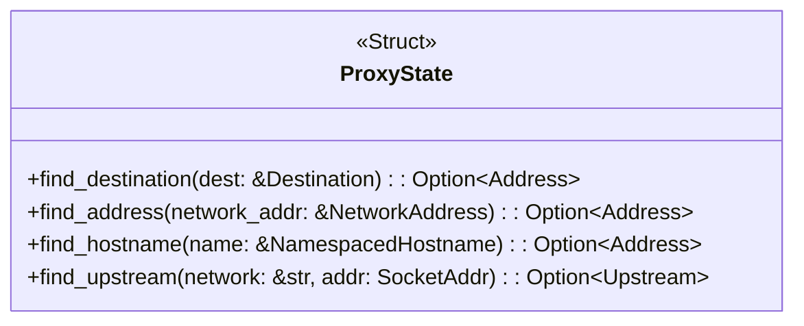
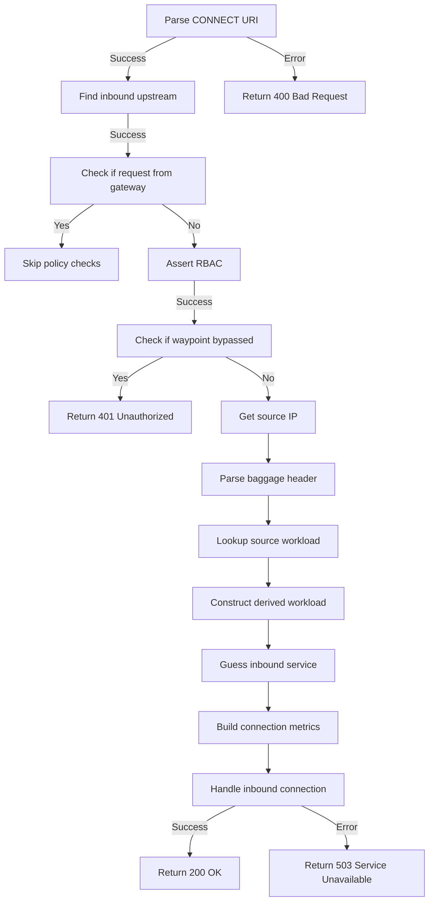
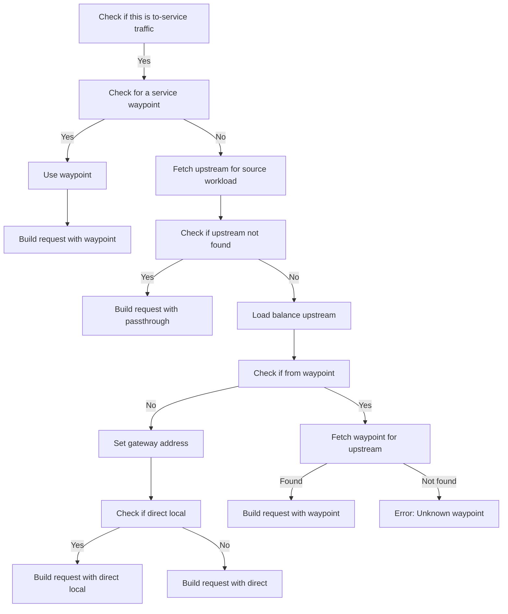

## state

```rust
// src/state.rs
/// The current state information for this proxy.
#[derive(serde::Serialize, Default, Debug)]
pub struct ProxyState {
    #[serde(flatten)]
    pub workloads: WorkloadStore,

    #[serde(flatten)]
    pub services: ServiceStore,

    #[serde(flatten)]
    pub policies: PolicyStore,

    #[serde(flatten)]
    pub resolved_dns: ResolvedDnsStore,
}
```



### Service

``` rust
pub struct Service {
    pub name: String,
    pub namespace: String,
    pub hostname: String,
    pub vips: Vec<NetworkAddress>,
    pub ports: HashMap<u16, u16>,

    /// Maps endpoint UIDs to service [Endpoint]s.
    #[serde(default)]
    pub endpoints: HashMap<String, Endpoint>,
    #[serde(default)]
    pub subject_alt_names: Vec<String>,
    pub waypoint: Option<GatewayAddress>,
}
```

### Workload

```rust
pub struct Workload {
    pub workload_ips: Vec<IpAddr>,

    #[serde(default, skip_serializing_if = "is_default")]
    pub waypoint: Option<GatewayAddress>,
    #[serde(default, skip_serializing_if = "is_default")]
    pub network_gateway: Option<GatewayAddress>,
    #[serde(default, skip_serializing_if = "is_default")]
    pub gateway_address: Option<SocketAddr>,

    #[serde(default)]
    pub protocol: Protocol,

    #[serde(default, skip_serializing_if = "is_default")]
    pub uid: String,
    #[serde(default)]
    pub name: String,
    pub namespace: String,
    #[serde(default, skip_serializing_if = "is_default")]
    pub trust_domain: String,
    #[serde(default, skip_serializing_if = "is_default")]
    pub service_account: String,
    #[serde(default, skip_serializing_if = "is_default")]
    pub network: String,

    #[serde(default, skip_serializing_if = "is_default")]
    pub workload_name: String,
    #[serde(default, skip_serializing_if = "is_default")]
    pub workload_type: String,
    #[serde(default, skip_serializing_if = "is_default")]
    pub canonical_name: String,
    #[serde(default, skip_serializing_if = "is_default")]
    pub canonical_revision: String,

    #[serde(default, skip_serializing_if = "is_default")]
    pub hostname: String,

    #[serde(default, skip_serializing_if = "is_default")]
    pub node: String,

    #[serde(default, skip_serializing_if = "is_default")]
    pub native_tunnel: bool,

    #[serde(default, skip_serializing_if = "is_default")]
    pub authorization_policies: Vec<String>,

    #[serde(default)]
    pub status: HealthStatus,

    #[serde(default)]
    pub cluster_id: String,
}
```

### 地址查询

```rust
/// Find either a workload or a service by address.
pub fn find_address(&self, network_addr: &NetworkAddress) -> Option<Address> {
    // 1. handle workload ip, if workload not found fallback to service.
    match self.workloads.find_address(network_addr) {
        None => {
            // 2. handle service
            if let Some(svc) = self.services.get_by_vip(network_addr) {
                return Some(Address::Service(Box::new(svc)));
            }
            None
        }
        Some(wl) => Some(Address::Workload(Box::new(wl))),
    }
}
```

## proxy

与 ztunnel 建立的一条连接定义为：

```rust
// src/rbac.rs
#[derive(Debug, Clone, Eq, Hash, Ord, PartialEq, PartialOrd)]
pub struct Connection {
    pub src_identity: Option<Identity>,
    pub src_ip: IpAddr,
    pub dst_network: String,
    pub dst: SocketAddr,
}
```

### inbound


_ztunnel 相连_


_sandwich waypoint_

```rust 
// src/proxy/inbound.rs
let conn = Connection {
    src_identity,
    src_ip,
    dst_network: network, // inbound request must be on our network
    dst,
};

// 其中
let src_identity: Option<Identity> = tls::identity_from_connection(ssl);
let dst = crate::socket::orig_dst_addr_or_default(raw_socket);
let src_ip = to_canonical(raw_socket.peer_addr().unwrap()).ip();
let pi = self.pi.clone();
let connection_manager = self.pi.connection_manager.clone();
let drain = sub_drain.clone();
let network = self.pi.cfg.network.clone(); // 由环境变量定义
```

`orig_dst_addr_or_default()` 通过获取流量中的 `SO_ORIGINAL_DST` 套接字选项来确定原始目的地。



### outbound

outbound 流量具有以下几种类型：

```rust
#[derive(PartialEq, Debug)]
enum RequestType {
    /// ToServerWaypoint refers to requests targeting a server waypoint proxy
    ToServerWaypoint,
    /// Direct requests are made directly to a intended backend pod
    Direct,
    /// DirectLocal requests are made directly to an intended backend pod *on the same node*
    DirectLocal,
    /// Passthrough refers to requests with an unknown target
    Passthrough,
}
```



## 参考

> [Rust Ztunnel 源码分析](https://blog.yanick.site/2023/03/07/networking/istio/ambient-mesh/ztunnel/#Workload-Manger-%E6%A8%A1%E5%9D%97)