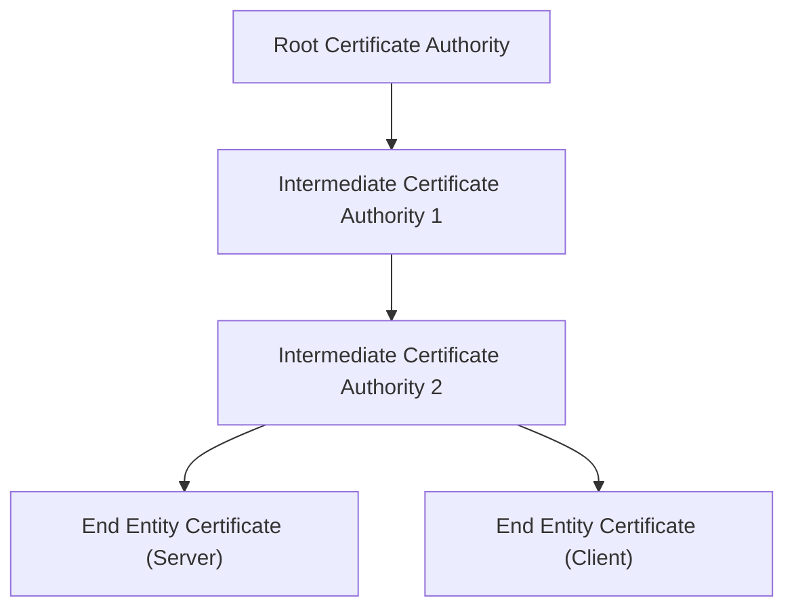

## 证书链

### 什么是证书链？

证书链是证书列表（通常以终端实体证书开头）后跟一个或多个CA证书（通常最后一个是自签名证书），具有以下属性：

每个证书（最后一个证书除外）的颁发者与列表中下一个证书的主题相匹配。

每个证书（最后一个证书除外）都应该由链中下一个证书对应的密钥签名（即一个证书的签名可以使用包含在后续证书中的公钥来验证）。

### 根证书和中间证书有什么区别？

- 根证书。根证书是属于颁发证书机构的数字证书。它已在大多数浏览器中预先下载并存储在所谓的“信任库”中。根证书由 CA 严密保护。
- 中间证书。中间证书像树枝一样从根证书分支出来。他们充当受保护的根证书和向公众颁发的服务器证书之间的中间人。链中始终至少有一个中间证书，但也可以有多个。
- 服务器证书。服务器证书是颁发给用户需要覆盖的特定域的证书。

证书链用于检查终端实体证书（链中的第一个证书）中包含的公钥和其他数据是否有效属于其主体。为了确定这一点，使用包含在以下证书中的公钥验证最终目标证书上的签名，使用下一个证书验证其签名，依此类推，直到到达链中的最后一个证书。由于最后一个证书是信任锚，成功到达它将证明终端实体证书是可信的。

> [证书链验证过程与测评方法](https://zhuanlan.zhihu.com/p/606755714)
>
> [根证书和中间证书有什么区别？](https://zhuanlan.zhihu.com/p/632398608)

## 自签名证书

| 证书类型 | 描述 |
| --- | --- |
| **自签名证书** | 自己颁发给自己的证书，颁发者和主体名相同。申请者无法向CA申请本地证书时，可以通过设备生成自签名证书，实现简单证书颁发功能。设备不支持对其生成的自签名证书进行生命周期管理（如证书更新、证书撤销等）。为确保设备和证书的安全，建议用户替换为自己的本地证书。 |
| **CA证书** | CA自身的证书。如果PKI系统中没有多层级CA，CA证书就是自签名证书；如果有多层级CA，则形成一个CA层次结构，最上层的CA是根CA，拥有一个CA“自签名”的证书。申请者通过验证CA的数字签名信任CA，任何申请者都可以得到CA的证书（含公钥），用以验证它所颁发的本地证书。 |
| **本地证书** | CA颁发给申请者的证书。 |
| **设备本地证书** | 设备根据CA证书颁发的证书，证书中的颁发者名称是CA服务器的名称。当申请者无法向CA申请本地证书时，可以通过设备生成设备本地证书，实现简单证书颁发功能。 |

自签名过程：

1、生成私钥

要创建SSL证书，需要私钥和证书签名请求（CSR）。您可以使用一些生成工具或向CA申请生成私钥，私钥是使用RSA和ECC等算法生成的加密密钥。生成RSA私钥的代码示例：openssl genrsa -aes256 -out servername.pass.key 4096，随后该命令会提示您输入密码。

2、生成CSR

私钥生成后，您的私钥文件现在将作为 servername.key 保存在您的当前目录中，并将用于生成CSR。自签名证书的CSR的代码示例：openssl req -nodes -new -key servername.key -out servername.csr。然后需要输入几条信息，包括组织、组织单位、国家、地区、城市和通用名称。通用名称即域名或IP地址。
输入此信息后，servername.csr 文件将位于当前目录中，其中包含 servername.key 私钥文件。

3、颁发证书

最后，使用server.key（私钥文件）和server.csr 文件生成新证书（.crt）。以下是生成新证书的命令示例：openssl x509 -req -sha256 -days 365 -in servername.csr -signkey servername.key -out servername.crt。最后，在您的当前目录中找到servername.crt文件即可。

### CSR

**CSR**（Certificate Signing Request，证书签名请求）是在申请数字证书时生成的文件。它包含了用于签发证书的公钥、辨识信息（例如域名）以及真实性和完整性保护（例如数字签名）。通常，Web 服务器会根据提供的信息创建 CSR，同时生成加解密的公钥-私钥对。

在创建 CSR 时，需要提供相关组织机构信息，Web 服务器会根据这些信息创建证书的标识名称，用来识别证书。以下是 CSR 中包含的信息：

- **国家或地区代码**：您的组织机构所在的国家或地区的代码，通常使用 ISO 的两字母格式表示。
- **省或市或自治区**：您的组织机构所在的省、市或自治区。
- **城市或地区**：您的组织机构注册所在的城市或地区。
- **组织机构**：您的企业依法注册所用的名称。
- **组织机构单位**：用于区分组织机构中的各部门，例如“工程部”或“人力资源部”。
- **通用名称**：在 CSR 的通用名称字段中输入的名称必须是您要为其使用证书的网站的完全限定域名（FQDN），例如“www.example.com”。

> [什么是自签名证书？自签名SSL证书的优缺点?](https://www.racent.com/blog/what-is-a-self-signed-certificate)